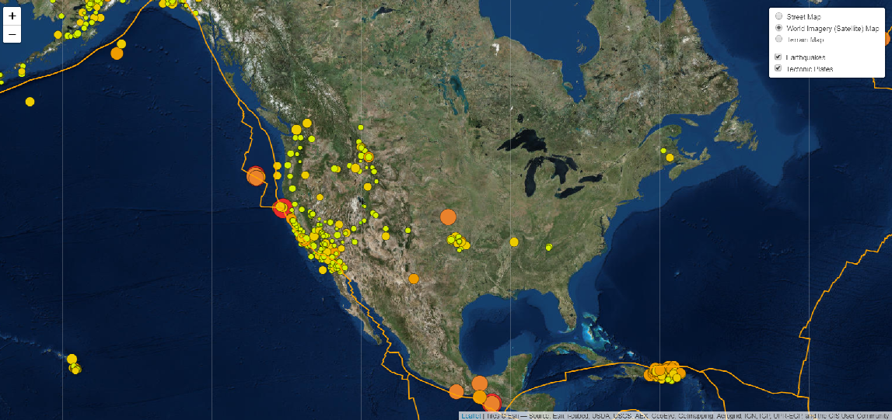

## USGS Earthquake Map
Javascript Code to create a Leaflet-based earthquake map. The map has three possible base maps and two overlay layers: earthquake incidences and tectonic plate locations. Earthquake markers are color-coded and sized according to the earthquake scale (magnitude). Finally, the tectonic plates layer makes it possible to compare earthquake locations to existing tectonic plates. These two layers may be turned on or off. The map is deployed to Github Pages at the site https://ashok-bidani.github.io/USGS-Earthquake-Map/.

## Map Navigation
Layers may be toggled using the Leaflet control in the top right corner of the map.

## Base Maps
I use three base maps for this Leaflet project, making use of the Leaflet-providers extension. Available layers via Leaflet-providers are shown here: https://leaflet-extras.github.io/leaflet-providers/preview/. I use the ESRI WorldStreetMap, the ESRI WorldImagery Map, and the ESRI WorldTerrain Map. The WorldImagery Map (which is a satellite view) is set to default.

## Overlay Layers
I use D3 to make a call to the USGS earthquake data - all earthquakes of scale 1.0+ in the past week. This data is then fed into Leaflet with the L.geoJson function along with styling for size and color of the earthquake marker. Earthquakes are represented by circle markers.

Then, tectonic plate data is also displayed by a similar means using data available at the source below.

## Sources
Tectonic plate data: https://github.com/fraxen/tectonicplates
USGS earthquake data: https://earthquake.usgs.gov/earthquakes/feed/v1.0/geojson.php
Leaflet: https://leafletjs.com/
